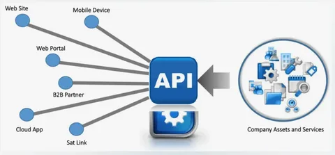

### **Модуль 1. Введение в API и сетевые технологии**

**Цель:** Дать общее понимание API, их роли в современной разработке и связи с другими модулями курса.

---

## 1. Что такое API?

### **1.1 Определение**

**API (Application Programming Interface)** — это набор правил и инструментов, позволяющий разным программам взаимодействовать между собой.

**Аналогия из жизни:**

> API — как официант в ресторане:
>
> - Вы (клиент) делаете **запрос** («Я хочу пиццу»)
> - Официант (API) передает его **кухне** (серверу)
> - Кухня готовит и возвращает **ответ** через официанта

### **1.2 Примеры API в реальном мире**

| **Сервис**          | **Что делает API**                                         |
| ------------------------------- | ------------------------------------------------------------------------- |
| Google Maps                     | Возвращает координаты или маршруты         |
| Twitter                         | Позволяет публиковать твиты программно |
| Погодные сервисы | Предоставляет данные о температуре         |



**Практическое задание:**
Откройте [JSONPlaceholder](https://jsonplaceholder.typicode.com/) (фейковый API) и выполните в браузере:

```
https://jsonplaceholder.typicode.com/posts/1
```

Посмотрите, как API возвращает данные в формате JSON.

---

## **2. Зачем нужны API?**

### **2.1 Основные преимущества**

- **Разделение ответственности:**Фронтенд и бэкенд работают независимо.
- **Масштабируемость:**Можно обновлять части системы без переделки всего кода.
- **Интеграция:**
  Сторонние сервисы (платежи, аутентификация) подключаются через API.

### **2.2 Типы API**

- **Публичные (OpenAPI):** Доступны всем (например, API GitHub).
- **Внутренние:** Используются только внутри компании.
- **Партнерские:** Для избранных интеграций (например, API для поставщиков).

**Дискуссия:**
*Какие API вы используете в своих проектах?*

---

## **3. О чем этот курс? **

### **3.1 Обзор модулей**

| **Модуль**                      | **Что изучим**                             | **Зачем это нужно?**                                |
| ------------------------------------------- | --------------------------------------------------------- | ---------------------------------------------------------------------- |
| 2. Как работает интернет | HTTP, DNS, IP-адреса                                | Понимать, как данные передаются в сети |
| 3. Виды API                             | REST, SOAP, RPC, GraphQL, gRPC                            | Выбирать правильный тип API для задачи   |
| 4–7. Проектирование API      | Практика с разными протоколами | Создавать эффективные и надежные API      |

### **3.2 Инструменты курса**

- **Для тестирования:** Postman, cURL
- **Для разработки:** Python (FastAPI, gRPC, Strawberry для GraphQL)
- **Для анализа:** Wireshark (разбор сетевых пакетов)

**Демонстрация:**
Покажем, как выглядит общение через API на примере простого REST-запроса:

```bash

curl -X GET https://api.github.com/users/octocat
curl.exe https://api.github.com/users/octocat
iwr "https://api.github.com/users/octocat"
irm -Headers @{"Accept"="application/json"} "https://api.github.com/users/octocat"
```

---

## **4. Подготовка к следующему модулю **

### **4.1 Что нужно установить?**

1. Python 3.10+: [Официальный сайт](https://www.python.org/downloads/)
2. Postman: [Скачать](https://www.postman.com/downloads/)
3. Git (опционально): [Установка](https://git-scm.com/)

### **4.2 Проверка окружения**

Откройте терминал и выполните:

```bash
python --version
curl --version
```

*Если команды не работают — время настроить окружение!*

---

## **5. Домашнее задание**

1. **Теоретическое:** Найти 3 публичных API (не из примера), описать их назначение.
2. **Практическое:** Сделать GET-запрос к [API SpaceX](https://docs.spacexdata.com/) и сохранить ответ в файл.
3. **Вопрос для размышления:**
   *Почему компании часто запрещают публичный доступ к своим API?*

---

## **6. Дополнительные материалы**

- [Что такое API? (простыми словами)](https://habr.com/ru/companies/ruvds/articles/464949/)
- [Список публичных API](https://github.com/public-apis/public-apis)
- [HTTP в деталях (Mozilla)](https://developer.mozilla.org/ru/docs/Web/HTTP)


```
https://api.spacexdata.com/v4/dragons

```
