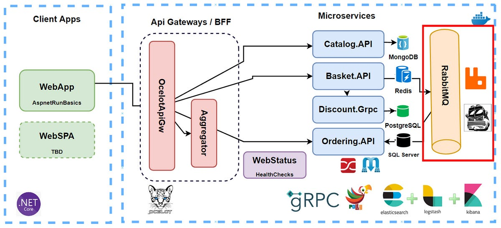

### **Урок: Брокеры сообщений на Python (RabbitMQ)**  
---

## **1. Теоретическая часть **  
### **1.1 Что такое брокер сообщений?**  
**Брокер сообщений** — промежуточное ПО для обмена сообщениями между системами.  

**Ключевые функции:**  
- Асинхронная коммуникация  
- Гарантированная доставка  
- Балансировка нагрузки  




### **1.2 RabbitMQ vs Другие брокеры**  
| **Критерий**       | RabbitMQ          | Kafka             | Redis Pub/Sub     |  
|--------------------|-------------------|-------------------|-------------------|  
| **Протокол**       | AMQP              | Свой протокол     | Pub/Sub           |  
| **Персистентность**| Да (на диск)      | Да                | Нет               |  
| **Сложность**      | Средняя           | Высокая           | Низкая            |  


```
Персистентность  — это свойство данных сохраняться между сеансами работы программы или после её завершения. 
```

### **1.3 Основные понятия RabbitMQ**  
- **Exchange** — точка входа для сообщений (типы: Direct, Fanout, Topic, Headers)  
- **Queue** — очередь сообщений  
- **Binding** — связь между exchange и очередью  

---

## **2. Практическая часть **  
### **2.1 Установка и настройка**  
```bash
# Установка RabbitMQ (Docker)
docker run -d --name rabbit -p 5672:5672 -p 15672:15672 rabbitmq:management

# Установка клиента Python
pip install pika
```

### **2.2 Производитель (Producer)**  
Файл `producer.py`:  
```python
import pika
import json

# Подключение
connection = pika.BlockingConnection(pika.ConnectionParameters('localhost'))
channel = connection.channel()

# Создание очереди
channel.queue_declare(queue='orders', durable=True)  # durable - сохраняет очередь при перезапуске

# Отправка сообщения
message = {
    "order_id": 123,
    "status": "new",
    "items": ["book", "pen"]
}
channel.basic_publish(
    exchange='',
    routing_key='orders',
    body=json.dumps(message),
    properties=pika.BasicProperties(
        delivery_mode=2  # Сохранять сообщения на диске
    )
)

print(" [x] Отправлено сообщение")
connection.close()
```

### **2.3 Потребитель (Consumer)**  
Файл `consumer.py`:  
```python
import pika
import json
import time

def callback(ch, method, properties, body):
    order = json.loads(body)
    print(f" [x] Обработка заказа {order['order_id']}")
    time.sleep(2)  # Имитация обработки
    print(" [x] Готово")
    ch.basic_ack(delivery_tag=method.delivery_tag)  # Подтверждение обработки

# Подключение
connection = pika.BlockingConnection(pika.ConnectionParameters('localhost'))
channel = connection.channel()

# Настройка очереди
channel.queue_declare(queue='orders', durable=True)
channel.basic_qos(prefetch_count=1)  # Обрабатывать по 1 сообщению за раз

# Подписка
channel.basic_consume(queue='orders', on_message_callback=callback)

print(' [*] Ожидание сообщений. Для выхода нажмите CTRL+C')
channel.start_consuming()
```

### **2.4 Запуск и тестирование**  
1. Запустите consumer в одном терминале:  
   ```bash
   python consumer.py
   ```  
2. Запустите producer в другом терминале:  
   ```bash
   python producer.py
   ```  

**Результат:**  
```
# Producer:
 [x] Отправлено сообщение

# Consumer:
 [*] Ожидание сообщений...
 [x] Обработка заказа 123
 [x] Готово
```

---

## **3. Продвинутые техники **  
### **3.1 Обменники (Exchange)**  
```python
# Создание обменника
channel.exchange_declare(exchange='logs', exchange_type='fanout')

# Отправка в обменник
channel.basic_publish(exchange='logs', routing_key='', body=message)
```

### **3.2 Dead Letter Queue**  
```python
args = {
    'x-dead-letter-exchange': 'dead_letters',
    'x-message-ttl': 60000  # TTL 60 сек
}
channel.queue_declare(queue='orders', arguments=args)
```

### **3.3 Кластеризация RabbitMQ**  
```bash
# Запуск 2 узлов
docker run -d --name rabbit1 -p 5672:5672 rabbitmq:management
docker run -d --name rabbit2 -p 5673:5672 --link rabbit1 rabbitmq:management
```

---

## **4. Домашнее задание**  
1. Реализуйте **Topic Exchange** для маршрутизации по категориям товаров  
2. Добавьте **подтверждение обработки** в producer  
3. Настройте **мониторинг** через RabbitMQ Management (http://localhost:15672)  

---

## **5. Полезные ссылки**  
- [Официальная документация RabbitMQ](https://www.rabbitmq.com/documentation.html)  
- [Руководство по pika](https://pika.readthedocs.io/)  
- [Примеры использования](https://github.com/rabbitmq/rabbitmq-tutorials)  

🚀 **Итог:** Вы научились работать с RabbitMQ для построения надежных асинхронных систем!