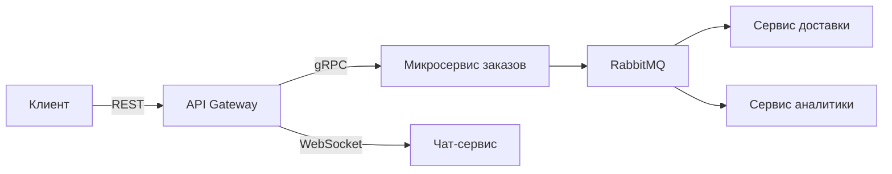
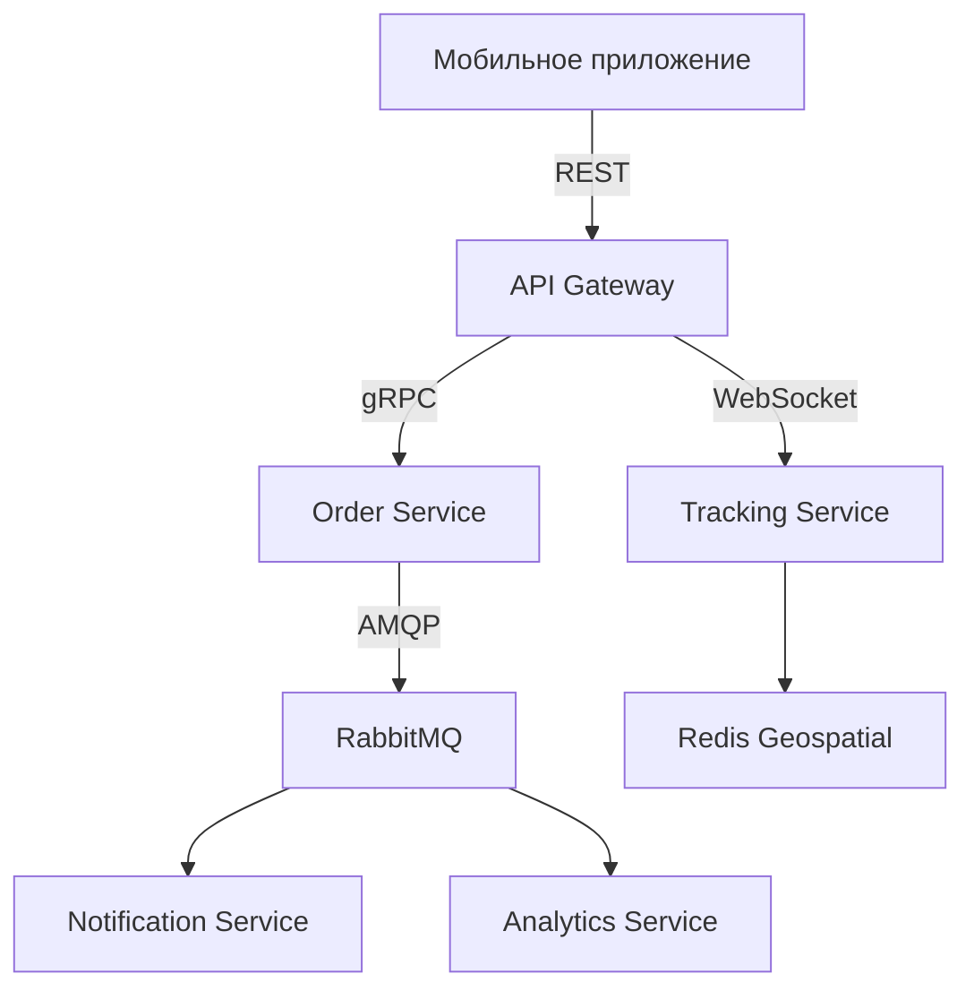

### **Урок: Solution Architecture и System Design - Введение**  
**Связь с предыдущими уроками:**  
Интеграция знаний о REST, gRPC, Event-based API и RabbitMQ в архитектурные решения.  
**Длительность:** 1 час  
**Уровень:** Продвинутый  
**Формат:** Теория + Кейс-стади  

---

## **1. Основы Solution Architecture **  
### **1.1 Что такое Solution Architecture?**  
**Определение:**  
Проектирование оптимальной структуры системы для решения бизнес-задач с учетом:  
- Масштабируемости  
- Надежности  
- Безопасности  
- Стоимости  

**Связь с пройденным:**  
| **Технология**       | **Архитектурная роль**               |  
|----------------------|--------------------------------------|  
| REST API             | Интерфейс для внешних клиентов       |  
| gRPC                 | Внутрисервисная коммуникация         |  
| RabbitMQ             | Асинхронная обработка событий        |  
| Event-based API      | Реактивные системы реального времени |  

### **1.2 Принципы System Design**  
1. **Модульность:** Микросервисы vs Монолит (когда что выбрать)  
2. **Горизонтальное масштабирование:** Балансировка нагрузки  
3. **Отказоустойчивость:** Circuit Breaker, Retry-логика  
4. **Кэширование:** Redis для высоконагруженных эндпоинтов  

**Пример из прошлых уроков:**  

---

## **2. Практический кейс: Дизайн платформы доставки еды **  
### **2.1 Требования**  
- 1000 заказов/мин  
- Реальное время отслеживания курьеров  
- Уведомления пользователям  
- Аналитика в реальном времени  

### **2.2 Архитектурное решение**  
**Компоненты:**  
1. **API Gateway (FastAPI):**  
   - REST для мобильных клиентов  
   - WebSocket для трекинга курьеров  
2. **Сервис заказов (gRPC):**  
   - Создание/обновление заказов  
   - Интеграция с платежами  
3. **Event Bus (RabbitMQ):**  
   - `order_created` → Аналитика и нотификации  
   - `courier_location` → Геосервис  
4. **Кэш (Redis):**  
   - Меню ресторанов  
   - Статусы заказов  

**Схема:**  

### **2.3 Решение проблем**  
**Проблема:** Пиковые нагрузки в обед  
**Решение:**  
- Автоскейлинг Kubernetes для Order Service  
- Priority Queue в RabbitMQ для VIP-заказов  
- Кэширование меню в Redis  

---

## **3. Инструменты архитектора**  
1. **Диаграммы:**  
   - C4-модель (Context, Containers, Components, Code)  
   - Mermaid.js для документации  
2. **Шаблоны:**  
   - Saga Pattern для распределенных транзакций  
   - CQRS для разделения чтения/записи  
3. **Оценка нагрузки:**  
   - Расчет RPS (Requests Per Second)  
   - Load testing (Locust)  

---

## **4. Домашнее задание**  
**Задача:** Спроектировать архитектуру стримингового сервиса (аналог Twitch):  
1. Определить ключевые компоненты  
2. Выбрать протоколы коммуникации  
3. Предложить решение для:  
   - Трансляции видео  
   - Чат в реальном времени  
   - Рекомендации контента  

**Формат:** Диаграмма Mermaid + пояснения на 1 страницу A4.  

---

## **5. Полезные ресурсы**  
- Книга: "Designing Data-Intensive Applications" (Martin Kleppmann)  
- Курс: "System Design Interview" (Alex Xu)  
- Шаблоны: https://microservices.io/patterns/  

🚀 Вы научились превращать бизнес-требования в технические решения, используя пройденные технологии!