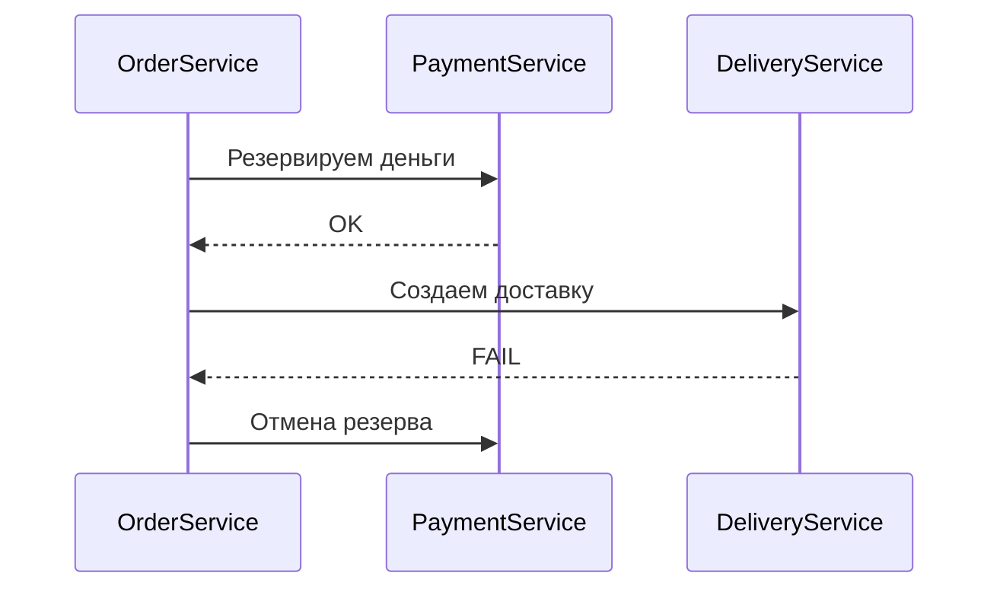
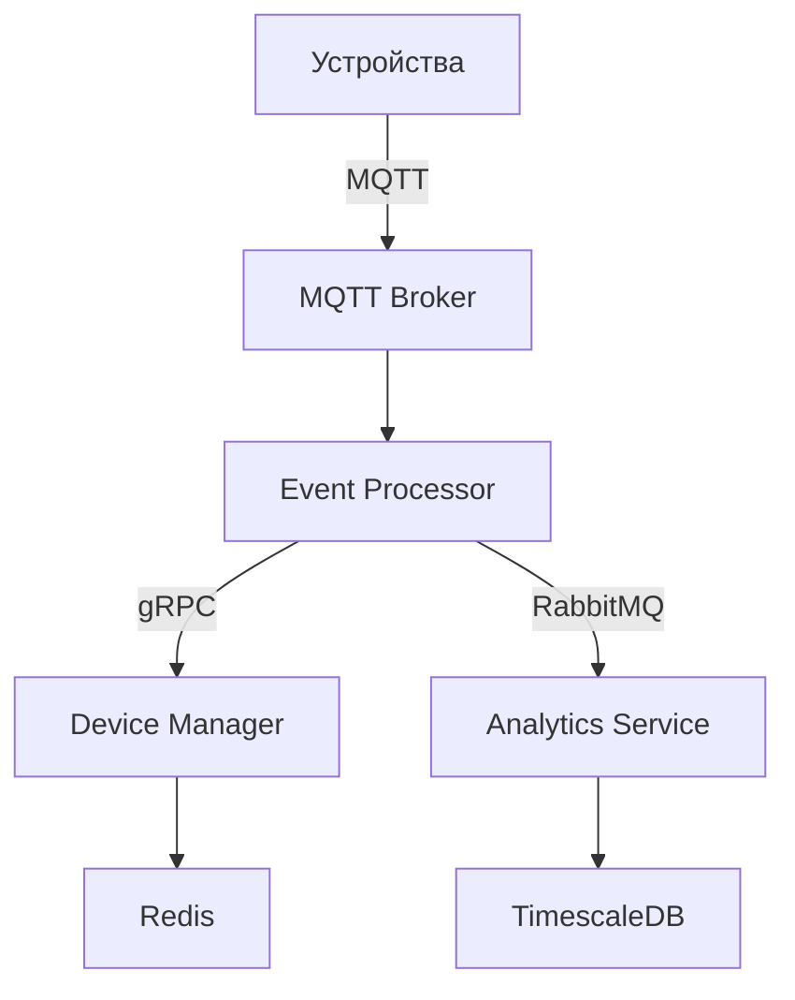

### **Урок: Solution Architecture и System Design - Технологические подходы**  
**Связь с предыдущим уроком:**  
Углубление в технические аспекты архитектуры на основе вводного урока.  
---

## **1. Ключевые технологические подходы **  
### **1.1 Стратегии интеграции**  
**Проблема:** Как соединить микросервисы?  

| **Подход**       | **Технологии**          | **Кейс применения**          |  
|------------------|-------------------------|------------------------------|  
| **Синхронный**   | REST/gRPC               | Платежи, где нужен мгновенный ответ |  
| **Асинхронный**  | RabbitMQ/Kafka          | Уведомления, обработка заказов |  
| **Event-Driven** | WebSockets/Server-Sent Events | Трекинг курьеров, чаты |  

**Пример из практики:**  
```python  
# gRPC для синхронных вызовов между микросервисами  
service PaymentService {  
  rpc ProcessPayment (PaymentRequest) returns (PaymentResponse);  
}  

# RabbitMQ для асинхронной обработки  
channel.basic_publish(exchange='orders', routing_key='payment_processed', body=json.dumps(data))  
```

---

### **1.2 Шаблоны проектирования**  
**Проблема:** Как обеспечить надежность?  

| **Паттерн**         | **Реализация**                     | **Для чего**                  |  
|---------------------|------------------------------------|-------------------------------|  
| **Circuit Breaker** | Polly (C#), resilience4j (Java)    | Защита от каскадных ошибок    |  
| **Saga**            | Choreography/RabbitMQ              | Распределенные транзакции     |  
| **CQRS**            | Отдельные БД для чтения/записи     | Высоконагруженные системы     |  

**Пример Saga:**  


---

## **2. Практика: Проектирование системы **  
### **Кейс: Умный дом (Smart Home)**  
**Требования:**  
- 100K устройств онлайн  
- Задержка < 100 мс  
- Оффлайн-работа устройств  

#### **Шаг 1: Выбор технологий**  
1. **Коммуникация:**  
   - Устройства → MQTT (легковесный протокол для IoT)  
   - Сервисы → gRPC + RabbitMQ  
2. **Хранение данных:**  
   - Текущие состояния → Redis  
   - История → TimescaleDB (для временных рядов)  

#### **Шаг 2: Диаграмма**  


#### **Шаг 3: Решение проблем**  
**Проблема:** Пиковые нагрузки при авариях  
**Решение:**  
- Локальный кэш на устройствах  
- Приоритетные очереди в RabbitMQ  
- Автомасштабирование Event Processor  

---

## **3. Инструменты архитектора **  
1. **Прототипирование:**  
   - Postman (для REST)  
   - BloomRPC (для gRPC)  
2. **Мониторинг:**  
   - Prometheus + Grafana  
   - Jaeger для трейсинга  
3. **Документирование:**  
   - Swagger для REST  
   - Protobuf docs для gRPC  

---

## **4. Групповое задание**  
**Задача:** Спроектировать систему для умного города (Smart City):  
- Транспортный мониторинг  
- Экологические датчики  
- Аварийные уведомления  

**Требования к решению:**  
1. Выбор протоколов коммуникации  
2. Схема взаимодействия сервисов  
3. Стратегия обработки пиковых нагрузок  

**Формат:**  
- 10 мин на обсуждение в группах  
- 5 мин на презентацию решений  

---

## **5. Критерии оценки архитектуры**  
1. **Масштабируемость:** Возможность добавить 1M устройств  
2. **Отказоустойчивость:** Время восстановления < 1 мин  
3. **Бюджет:** Оптимизация облачных затрат  

---

## **6. Дополнительные материалы**  
- Книга: "Building Microservices" (Sam Newman)  
- Курс: "Designing Distributed Systems" (Brendan Burns)  
- Репозиторий шаблонов: https://github.com/ddd-by-examples  

🚀 Вы научились выбирать технологии под конкретные архитектурные требования!