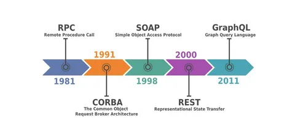
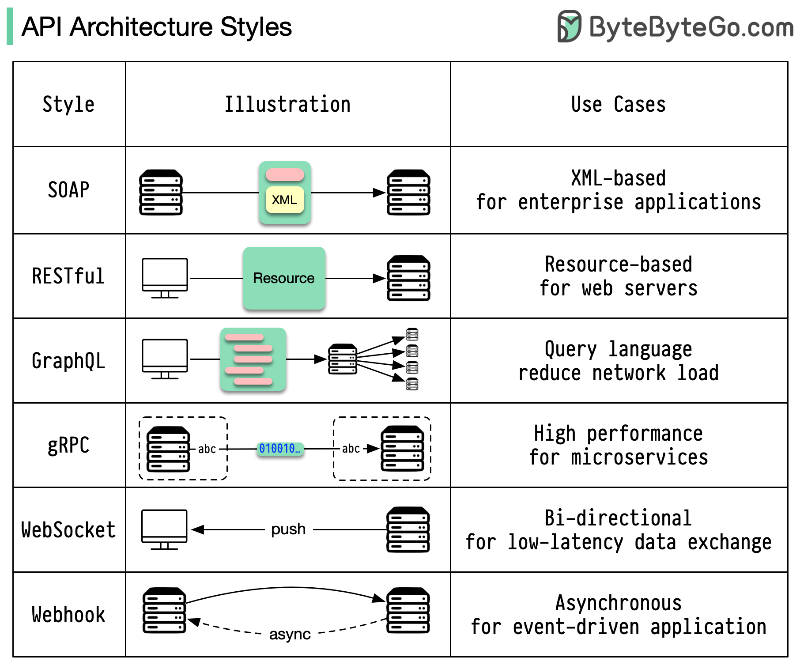
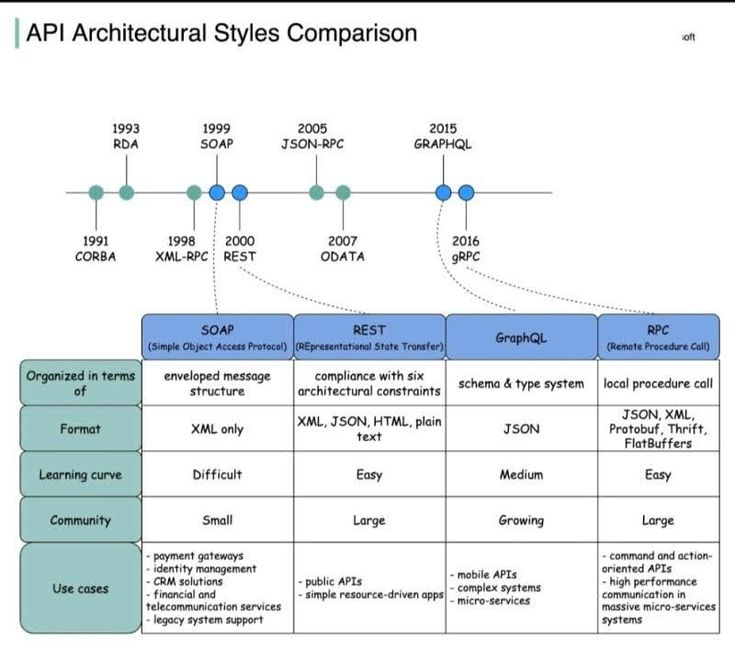

### **Модуль 3: Виды API — REST, SOAP, RPC, GraphQL, gRPC**  
**Цель:** Научиться выбирать тип API под конкретные задачи.  

---

## **1. Критерии выбора API **  



Перед выбором технологии ответьте на вопросы:  
1. **Какие клиенты будут использовать API?**  
   - Браузеры, мобильные приложения, микросервисы.  
2. **Нужна ли строгая типизация?**  
   - Например, для банковских транзакций.  
3. **Важна ли скорость передачи данных?**  
   - gRPC для внутренних сервисов, REST для публичных API.  
4. **Будет ли API публичным?**  
   - REST/GraphQL удобнее для фронтенда, SOAP — для enterprise.  



---

## **2. Сравнение технологий**  

### **2.1 REST (Representational State Transfer)**  
**Когда использовать:**  
- Публичные API (например, для мобильных приложений).  
- Простые CRUD-операции (создание/чтение/обновление/удаление).  

**Плюсы:**  
✅ Простота (HTTP + JSON).  
✅ Кеширование.  
✅ Поддержка браузерами.  

**Минусы:**  
❌ Over-fetching (клиент получает лишние данные).  
❌ Нет строгой типизации.  

**Пример запроса:**  
```bash
GET /api/users/1 HTTP/1.1
Host: example.com
```

---

### **2.2 SOAP (Simple Object Access Protocol)**  
**Когда использовать:**  
- Высокозащищенные enterprise-системы (банки, госучреждения).  
- Сложные транзакции с гарантированной доставкой.  

**Плюсы:**  
✅ Встроенная безопасность (WS-Security).  
✅ Строгая типизация (WSDL-схема).  
✅ Поддержка ACID-транзакций.  

**Минусы:**  
❌ Сложность (XML, большие сообщения).  
❌ Низкая производительность.  

**Пример запроса:**  
```xml
<soap:Envelope>
  <soap:Body>
    <GetUserRequest>
      <UserId>1</UserId>
    </GetUserRequest>
  </soap:Body>
</soap:Envelope>
```

---

### **2.3 RPC (JSON-RPC/gRPC)**  
**Когда использовать:**  
- Внутрисервисное взаимодействие (микросервисы).  
- Высоконагруженные системы (игры, стриминг).  

**Плюсы:**  
✅ Высокая скорость (бинарные протоколы).  
✅ Поддержка потоков (gRPC).  

**Минусы:**  
❌ Сложная отладка (бинарные данные).  
❌ Нет поддержки в браузерах (требуется gRPC-Web).  

**Пример gRPC:**  
```protobuf
service UserService {
  rpc GetUser (UserRequest) returns (UserResponse);
}
```

---

### **2.4 GraphQL**  
**Когда использовать:**  
- Сложные клиенты с динамическими запросами (например, SaaS-платформы).  
- Когда нужно избежать over-fetching.  

**Плюсы:**  
✅ Клиент запрашивает только нужные данные.  
✅ Единый эндпоинт для всех запросов.  

**Минусы:**  
❌ Сложность кеширования.  
❌ N+1 проблема без оптимизации.  

**Пример запроса:**  
```graphql
query {
  user(id: 1) {
    name
    email
  }
}
```

---

## **3. Практические кейсы **  
### **Кейс 1: Социальная сеть**  
**Задача:** API для мобильного приложения с лентой новостей.  
**Выбор:**  
- **REST** — если данные фиксированные.  
- **GraphQL** — если клиенту нужна гибкость (например, выбор полей для отображения).  

### **Кейс 2: Банковские транзакции**  
**Задача:** Переводы между счетами с гарантированной доставкой.  
**Выбор:**  
- **SOAP** — из-за встроенной безопасности и поддержки транзакций.  

### **Кейс 3: Микросервисы в Kubernetes**  
**Задача:** Общение между 10+ сервисами.  
**Выбор:**  
- **gRPC** — для высокой скорости и поддержки потоков.  

---

## **4. Домашнее задание**  
1. **Теоретическое:**  
   - Сравните REST и GraphQL для e-commerce API.  
2. **Практическое:**  
   - Создайте простой REST и GraphQL эндпоинт для одной сущности (например, `Product`).  
3. **Эксперимент:**  
   - Замерьте скорость работы gRPC vs REST (используя [ghz](https://ghz.sh/) для тестирования).  

---

## **5. Чеклист выбора API**  
| **Требование**         | **REST** | **SOAP** | **gRPC** | **GraphQL** |  
|------------------------|----------|----------|----------|-------------|  
| Публичное API          | ✅       | ❌       | ❌       | ✅          |  
| Высокая скорость       | ❌       | ❌       | ✅       | ❌          |  
| Гибкость запросов      | ❌       | ❌       | ❌       | ✅          |  
| Безопасность           | ⚠️       | ✅       | ✅       | ⚠️          |  
| Поддержка браузеров    | ✅       | ✅       | ❌       | ✅          |  

---



## **6. Дополнительные материалы**  
- [REST vs GraphQL](https://www.apollographql.com/blog/graphql-vs-rest-5d425123e34b/)  
- [gRPC для микросервисов](https://grpc.io/blog/grpc-in-production/)  
- [Сравнение SOAP и REST](https://www.soapui.org/learn/api/soap-vs-rest-api.html)  

🚀 **Итог:** Теперь вы можете обоснованно выбирать тип API для своих проектов!


### **🔥 Практические примеры  как выбрать API?**  

Выбор технологии API — критичное решение, влияющее на скорость разработки, масштабируемость и удобство поддержки. Разберём **реальные кейсы** и **жёсткие trade-off**, с которыми сталкиваются разработчики.  

---

## **1. Какие клиенты будут использовать API?**  
### **🚀 Пример 1: Мобильное приложение + веб**  
**Проблема:**  
- У вас **React-сайт** и **iOS/Android-приложение**.  
- Нужно минимизировать трафик и ускорить загрузку.  

**Решение:**  
✅ **GraphQL** (если клиентам нужна гибкость):  
```graphql
query {
  user(id: "123") {
    name
    email
    lastOrder { id, date }
  }
}
```  
➡ **Плюсы:** Клиент сам выбирает, какие поля получать (меньше перегрузки).  
➡ **Минусы:** Сложнее кешировать, чем REST.  

❌ **REST** (если API простое):  
```bash
GET /users/123?fields=name,email,lastOrder
```  
➡ Проще, но менее гибко.  

---

## **2. Нужна ли строгая типизация?**  
### **💸 Пример 2: Банковские транзакции**  
**Проблема:**  
- Нужна **100% точность** в форматах данных (например, `amount: decimal(10,2)`).  
- Клиенты — другие банки (используют **SOAP**).  

**Решение:**  
✅ **gRPC** (бинарный протокол + Protobuf):  
```protobuf
message Transaction {
  string id = 1;
  double amount = 2;
  string currency = 3;
}
```  
➡ Автоматическая валидация типов + высокая скорость.  

❌ **REST/JSON** (если партнёры требуют SOAP):  
```xml
<soap:Envelope>
  <soap:Body>
    <Transaction>
      <Amount>100.00</Amount>
      <Currency>USD</Currency>
    </Transaction>
  </soap:Body>
</soap:Envelope>
```  
➡ Придётся писать XSD-схемы и ручные парсеры.  

---

## **3. Важна ли скорость передачи данных?**  
### **🎮 Пример 3: Игровой сервис стриминга**  
**Проблема:**  
- Нужна **минимальная задержка** (latency < 50 мс).  
- Клиенты — Unity/C++ игры.  

**Решение:**  
✅ **gRPC + HTTP/2** (бинарный протокол, мультиплексирование):  
```go
service GameStream {
  rpc SendPlayerInput (Input) returns (Response);
}
```  
➡ В 5-10 раз быстрее REST.  

❌ **REST + JSON** (если API публичное):  
```bash
POST /api/input {"x": 100, "y": 200, "action": "jump"}
```  
➡ Проще для отладки, но медленнее.  

---

## **4. Будет ли API публичным?**  
### **🛒 Пример 4: E-commerce API для партнёров**  
**Проблема:**  
- Внешние магазины подключаются к вашему каталогу.  
- Нужна **документация** и простота интеграции.  

**Решение:**  
✅ **REST + OpenAPI** (Swagger):  
```yaml
paths:
  /products:
    get:
      summary: "Список товаров"
      parameters:
        - name: "category"
          in: query
          type: string
```  
➡ **Плюсы:**  
- Frontend-разработчики сразу видят документацию.  
- Можно сгенерировать клиентский SDK.  

❌ **GraphQL** (если партнёры не готовы к нему):  
```graphql
query {
  products(category: "electronics") {
    id, name, price
  }
}
```  
➡ **Минусы:**  
- Сложнее контролировать нагрузку (клиенты могут запросить «всё»).  

---

## **📌 Итоговая таблица выбора**  
| Критерий               | Лучший выбор       | Альтернатива     | Когда не брать?     |
|------------------------|-------------------|------------------|---------------------|
| **Мультиплатформенность** | GraphQL/REST     | gRPC             | Если клиенты только мобильные (gRPC). |
| **Строгая типизация**  | gRPC/SOAP        | JSON Schema      | Для MVP с быстрым прототипированием. |
| **Скорость**           | gRPC/WebSockets  | REST             | Если API для людей (не машин). |
| **Публичное API**      | REST + OpenAPI   | GraphQL          | Если бэкенд на GraphQL уже есть. |

---

## **⚡ Жёсткие кейсы**  
### **Кейс 5: У вас уже есть REST, но нужна скорость**  
**Решение:**  
- Оставить REST для публичного API.  
- Для внутренних сервисов добавить **gRPC**.  

### **Кейс 6: Клиенты хотят GraphQL, но бэкенд на SOAP**  
**Решение:**  
- Поставить **GraphQL-прокси** (Apollo Server), который конвертирует запросы в SOAP.  

```ts
const resolvers = {
  Query: {
    user: async (_, { id }) => {
      const soapResponse = await convertToSOAP(id);
      return soapResponse;
    }
  }
};
```

---

## **🔧 Что делать дальше?**  
1. **Протестируйте нагрузку:**  
   - `wrk -t12 -c100 -d30s http://api.yourservice.com` (для REST).  
2. **Задокументируйте API:**  
   - Swagger (REST), Apollo Studio (GraphQL).  
3. **Мониторьте ошибки:**  
   - Sentry, Grafana + Prometheus.  

Выбор API — это всегда компромисс. Определите **главный критерий** (скорость, гибкость, поддержка) и выбирайте осознанно! 🚀