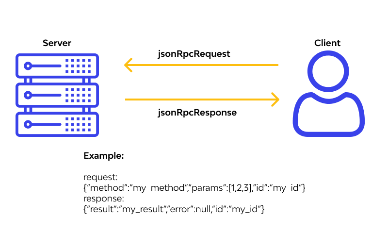

# Модуль 4. Проектирование API - JSON-RPC. 




### **API JSON-RPC: для чего нужен?**  

**JSON-RPC** – это протокол для удаленного вызова функций (методов) между клиентом и сервером с использованием JSON. Он нужен для **простого, быстрого и структурированного взаимодействия** между разными системами, особенно там, где важны:  
- **Минимализм** (маленький размер сообщений).  
- **Гибкость** (любые названия методов и параметров).  
- **Независимость от транспорта** (работает поверх HTTP, WebSockets, TCP и др.).  

---

## **1. Основные задачи JSON-RPC**  

### **1.1 Удаленный вызов функций (RPC)**  
Позволяет клиенту вызывать методы на сервере так, будто они локальные.  

**Пример:**  
```json
// Запрос: "Выполни метод add с параметрами 2 и 3"
{
  "jsonrpc": "2.0",
  "method": "add",
  "params": [2, 3],
  "id": 1
}

// Ответ:
{
  "jsonrpc": "2.0",
  "result": 5,
  "id": 1
}
```


### **1.2 Обмен данными между клиентом и сервером**  
- **Веб-приложения** (Frontend ↔ Backend).  
- **Микросервисы** (Сервис A ↔ Сервис B).  
- **Блокчейн** (Клиент ↔ Нода Ethereum/Bitcoin).  

### **1.3 Альтернатива REST, GraphQL, SOAP**  
- **Проще REST**, где нужно продумывать ресурсы (`/users`, `/posts`).  
- **Легче SOAP**, где XML слишком многословен.  
- **Более низкоуровневый, чем GraphQL** (нет встроенного Query Language).  

---

## **2. Где применяется JSON-RPC?**  

### **2.1 Веб-разработка (Backend ↔ Frontend)**  
- **SPA (React, Vue, Angular)** – общение с API без перезагрузки страницы.  
- **Мобильные приложения** – запросы к серверу.  

**Пример:**  
```javascript
// Вызов метода "getUserProfile" с параметром userId=42
fetch('/api', {
  method: 'POST',
  body: JSON.stringify({
    jsonrpc: '2.0',
    method: 'getUserProfile',
    params: { userId: 42 },
    id: 1
  })
});
```

### **2.2 Блокчейн и криптовалюты**  
- **Bitcoin, Ethereum** используют JSON-RPC для взаимодействия с узлами.  
- **MetaMask, Web3.js** – работают через JSON-RPC запросы.  

**Пример запроса к Ethereum:**  
```json
{
  "jsonrpc": "2.0",
  "method": "eth_sendTransaction",
  "params": [{ "from": "0x...", "to": "0x...", "value": "0x..." }],
  "id": 1
}
```

### **2.3 Микросервисы и облачные API**  
- **Внутреннее взаимодействие сервисов** (например, платежный сервис ↔ сервис заказов).  
- **IoT (умные устройства)** – отправка команд датчикам.  

### **2.4 Игры и реальное время (WebSockets)**  
- **Multiplayer-игры** – синхронизация действий игроков.  
- **Чат-приложения** – отправка сообщений через JSON-RPC + WebSocket.  

---

## **3. Почему выбирают JSON-RPC?**  

| **Критерий**       | **JSON-RPC**                          | **REST**                     | **GraphQL**                |
|--------------------|---------------------------------------|------------------------------|----------------------------|
| **Формат данных**  | JSON                                  | JSON/XML                     | JSON                       |
| **Гибкость**       | Любые методы (`addUser`, `getData`)   | Ограничено HTTP-методами     | Запросы определяет клиент  |
| **Размер запроса** | Компактный (меньше REST с URL-параметрами) | Зависит от эндпоинтов       | Может быть большим         |
| **Сложность**      | Очень простой                         | Средняя (нужны роуты)        | Высокая (нужна схема)      |
| **Использование**  | Блокчейн, микросервисы, IoT           | Веб-API, мобильные приложения | Сложные API (GitHub, Shopify) |

---

## **4. Вывод**  
**JSON-RPC нужен для:**  
✅ **Удаленного вызова методов** (как если бы они были локальными).  
✅ **Обмена данными** между клиентом и сервером в JSON-формате.  
✅ **Альтернативы REST/GraphQL**, когда важна простота и скорость.  
✅ **Работы с блокчейном, IoT, микросервисами**.  

**Когда выбирать JSON-RPC?**  
- Если API **командное** (вызов действий, а не работа с ресурсами).  
- Если нужен **минимализм** (без лишних заголовков, как в REST).  
- Если важна **поддержка разных транспортов** (HTTP, WebSockets, etc).  

**Примеры реализации:**  
- Python: `json-rpc`, `aiohttp-json-rpc`  
- JavaScript: `jsonrpc-client`, `web3.js` (для Ethereum)  
- PHP: `jsonrpc/server`  

Если вам нужно **максимально простое API** без сложных правил – JSON-RPC отличный выбор! 🚀


Пример запроса:  
```json
{
  "jsonrpc": "2.0",
  "method": "getUser",
  "params": {"id": 123},
  "id": 1
}
```
Пример ответа:  
```json
{
  "jsonrpc": "2.0",
  "result": {"name": "Alice", "age": 30},
  "id": 1
}
```

---
#### **Заключение**  
JSON-RPC – это простой и эффективный протокол для вызова удаленных методов, особенно полезный в случаях, когда важны минимализм и гибкость. Версия 2.0 исправила недостатки 1.0 и стала стандартом для многих современных систем.  

**Дополнительные темы для изучения:**  
- Реализации JSON-RPC в разных языках (Python: `json-rpc`, JS: `jsonrpc-client`).  
- Асинхронный JSON-RPC (например, через WebSockets).  
- Безопасность (аутентификация, HTTPS, ограничение методов).