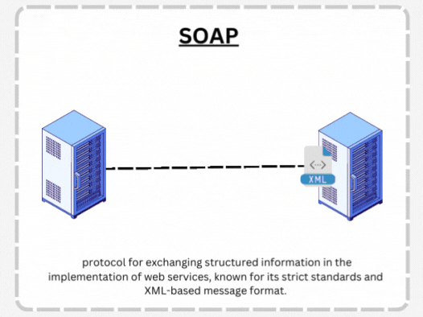
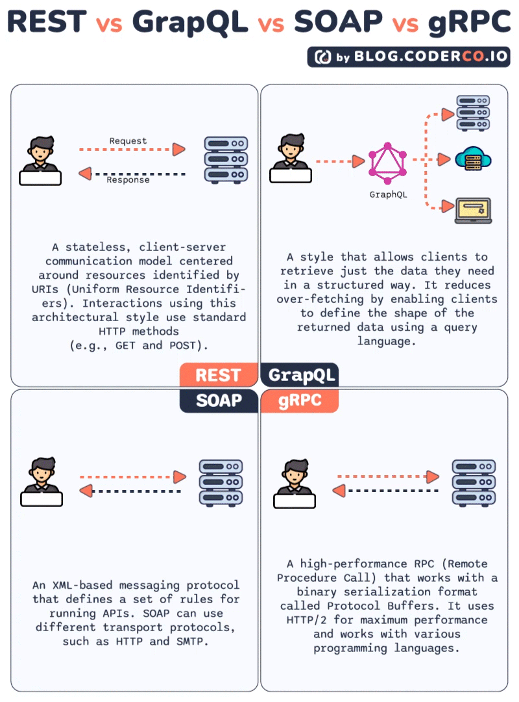

### **Проектирование API – SOAP**  




## **1. Введение**  
### **1.1 Что такое SOAP?**  
- **SOAP** (Simple Object Access Protocol) – протокол для обмена структурированными сообщениями в распределённых системах.  
- Работает поверх **HTTP/HTTPS**, использует **XML**.  
- Основные компоненты:  
  - **Envelope** – корневой элемент.  
  - **Header** (опционально) – метаданные (аутентификация, логирование).  
  - **Body** – данные запроса/ответа.  




### **1.2 Когда используют SOAP?**  
- **Корпоративные системы** (банки, госучреждения).  
- **Сложные транзакции** (например, платежи).  
- **Строгая типизация и безопасность** (WS-Security, SSL).  
- **Интеграция legacy-систем**.  
- **Требования к ACID-транзакциям**.  

**Пример SOAP-запроса:**  
```xml
<soap:Envelope xmlns:soap="http://schemas.xmlsoap.org/soap/envelope/">
  <soap:Body>
    <GetUserRequest xmlns="http://example.com/">
      <UserId>123</UserId>
    </GetUserRequest>
  </soap:Body>
</soap:Envelope>
```

---

## **2. WSDL (Web Services Description Language)**  

### **2.1 Что такое WSDL?**  
- **XML-документ**, описывающий веб-сервис.  
- Содержит информацию о методах, параметрах, типах данных.  
- Позволяет **автогенерацию клиентского кода**.  

### **2.2 Структура WSDL**  
```xml
<definitions xmlns="http://schemas.xmlsoap.org/wsdl/">
  <types>        <!-- Типы данных (XSD) -->
  <message>      <!-- Сообщения (параметры методов) -->
  <portType>     <!-- Интерфейс (методы сервиса) -->
  <binding>      <!-- Привязка к протоколу (SOAP/HTTP) -->
  <service>      <!-- Конечная точка (URL) -->
</definitions>
```

### **2.3 Пример WSDL**  
```xml
<definitions xmlns="http://schemas.xmlsoap.org/wsdl/" 
             targetNamespace="http://example.com/userservice">
  
  <types>
    <xsd:schema targetNamespace="http://example.com/userservice">
      <xsd:element name="GetUserRequest">
        <xsd:complexType>
          <xsd:sequence>
            <xsd:element name="UserId" type="xsd:int"/>
          </xsd:sequence>
        </xsd:complexType>
      </xsd:element>
      
      <xsd:element name="GetUserResponse">
        <xsd:complexType>
          <xsd:sequence>
            <xsd:element name="User" type="tns:User"/>
          </xsd:sequence>
        </xsd:complexType>
      </xsd:element>
      
      <xsd:complexType name="User">
        <xsd:sequence>
          <xsd:element name="Id" type="xsd:int"/>
          <xsd:element name="Name" type="xsd:string"/>
          <xsd:element name="Email" type="xsd:string"/>
        </xsd:sequence>
      </xsd:complexType>
    </xsd:schema>
  </types>
  
  <message name="GetUserRequestMessage">
    <part name="parameters" element="tns:GetUserRequest"/>
  </message>
  
  <message name="GetUserResponseMessage">
    <part name="parameters" element="tns:GetUserResponse"/>
  </message>
  
  <portType name="UserServicePortType">
    <operation name="GetUser">
      <input message="tns:GetUserRequestMessage"/>
      <output message="tns:GetUserResponseMessage"/>
    </operation>
  </portType>
  
  <binding name="UserServiceBinding" type="tns:UserServicePortType">
    <soap:binding transport="http://schemas.xmlsoap.org/soap/http"/>
    <operation name="GetUser">
      <soap:operation soapAction="http://example.com/GetUser"/>
      <input><soap:body use="literal"/></input>
      <output><soap:body use="literal"/></output>
    </operation>
  </binding>
  
  <service name="UserService">
    <port name="UserServicePort" binding="tns:UserServiceBinding">
      <soap:address location="http://example.com/userservice"/>
    </port>
  </service>
  
</definitions>
```

---

## **3. Безопасность в SOAP**  

### **3.1 WS-Security**  
- **Стандарт безопасности** для веб-сервисов.  
- Поддерживает **аутентификацию, авторизацию, шифрование**.  
- Работает на уровне **SOAP-сообщений**.  

### **3.2 Типы безопасности**  

#### **Username Token**  
```xml
<soap:Header>
  <wsse:Security xmlns:wsse="http://docs.oasis-open.org/wss/2004/01/oasis-200401-wss-wssecurity-secext-1.0.xsd">
    <wsse:UsernameToken>
      <wsse:Username>admin</wsse:Username>
      <wsse:Password Type="http://docs.oasis-open.org/wss/2004/01/oasis-200401-wss-username-token-profile-1.0#PasswordDigest">
        hashed_password
      </wsse:Password>
      <wsse:Nonce>random_nonce</wsse:Nonce>
      <wsu:Created>2024-01-01T12:00:00Z</wsu:Created>
    </wsse:UsernameToken>
  </wsse:Security>
</soap:Header>
```

#### **X.509 Certificate**  
```xml
<soap:Header>
  <wsse:Security>
    <wsse:BinarySecurityToken 
      ValueType="http://docs.oasis-open.org/wss/2004/01/oasis-200401-wss-x509-token-profile-1.0#X509v3"
      EncodingType="http://docs.oasis-open.org/wss/2004/01/oasis-200401-wss-soap-message-security-1.0#Base64Binary">
      MIICXjCCAcegAwIBAgIJAK...
    </wsse:BinarySecurityToken>
  </wsse:Security>
</soap:Header>
```

### **3.3 Шифрование и цифровые подписи**  
- **WS-Encryption** – шифрование части сообщения.  
- **WS-Signature** – цифровая подпись для целостности.  
- **SSL/TLS** – транспортный уровень безопасности.  

---

## **4. Практическая реализация на Python**  

### **4.1 SOAP-сервер с использованием Spyne**  

```python
from spyne import Application, rpc, ServiceBase, Integer, Unicode
from spyne.protocol.soap import Soap11
from spyne.server.wsgi import WsgiApplication
from wsgiref.simple_server import make_server

class UserService(ServiceBase):
    @rpc(Integer, _returns=Unicode)
    def get_user(ctx, user_id):
        # Имитация получения пользователя из БД
        users = {
            1: "Иван Иванов",
            2: "Петр Петров",
            3: "Анна Сидорова"
        }
        return users.get(user_id, "Пользователь не найден")
    
    @rpc(Unicode, Unicode, _returns=Unicode)
    def create_user(ctx, name, email):
        # Имитация создания пользователя
        return f"Пользователь {name} ({email}) создан успешно"

# Создание SOAP-приложения
application = Application([UserService],
    tns='http://example.com/userservice',
    in_protocol=Soap11(validator='lxml'),
    out_protocol=Soap11()
)

# WSGI-приложение
wsgi_app = WsgiApplication(application)

if __name__ == '__main__':
    server = make_server('127.0.0.1', 8000, wsgi_app)
    print("SOAP сервер запущен на http://127.0.0.1:8000")
    print("WSDL доступен по адресу: http://127.0.0.1:8000?wsdl")
    server.serve_forever()
```

### **4.2 SOAP-клиент с использованием Zeep**  

```python
from zeep import Client

# Подключение к SOAP-сервису
client = Client('http://127.0.0.1:8000?wsdl')

# Вызов метода get_user
result = client.service.get_user(user_id=1)
print(f"Результат: {result}")

# Вызов метода create_user
result = client.service.create_user(name="Новый Пользователь", email="new@example.com")
print(f"Результат: {result}")

# Просмотр доступных методов
print("\nДоступные методы:")
for service in client.wsdl.services.values():
    for port in service.ports.values():
        operations = sorted(port.binding._operations.keys())
        for operation in operations:
            print(f"- {operation}")
```

### **4.3 SOAP с аутентификацией**  

```python
from zeep import Client
from zeep.wsse.username import UsernameToken

# Клиент с аутентификацией
wsse = UsernameToken('admin', 'password')
client = Client('http://example.com/secure-service?wsdl', wsse=wsse)

# Вызов защищенного метода
result = client.service.secure_method(param="value")
print(result)
```

---

## **5. Обработка ошибок в SOAP**  

### **5.1 SOAP Fault**  
```xml
<soap:Envelope xmlns:soap="http://schemas.xmlsoap.org/soap/envelope/">
  <soap:Body>
    <soap:Fault>
      <faultcode>Client</faultcode>
      <faultstring>Invalid user ID</faultstring>
      <detail>
        <error xmlns="http://example.com/">
          <code>USER_NOT_FOUND</code>
          <message>Пользователь с ID 999 не найден</message>
        </error>
      </detail>
    </soap:Fault>
  </soap:Body>
</soap:Envelope>
```

### **5.2 Обработка ошибок в Python**  

```python
from spyne import Fault
from zeep.exceptions import Fault as ZeepFault

# В сервере (Spyne)
class UserService(ServiceBase):
    @rpc(Integer, _returns=Unicode)
    def get_user(ctx, user_id):
        if user_id <= 0:
            raise Fault('Client', 'Invalid user ID')
        
        users = {1: "Иван", 2: "Петр"}
        if user_id not in users:
            raise Fault('Server', 'User not found', detail={'code': 'USER_NOT_FOUND'})
        
        return users[user_id]

# В клиенте (Zeep)
try:
    result = client.service.get_user(user_id=-1)
except ZeepFault as fault:
    print(f"SOAP Fault: {fault.message}")
    print(f"Fault Code: {fault.code}")
    if fault.detail:
        print(f"Detail: {fault.detail}")
```

---

## **6. Тестирование SOAP API**  

### **6.1 Юнит-тесты**  

```python
import pytest
from zeep import Client
from zeep.exceptions import Fault

class TestUserService:
    @classmethod
    def setup_class(cls):
        cls.client = Client('http://127.0.0.1:8000?wsdl')
    
    def test_get_existing_user(self):
        result = self.client.service.get_user(user_id=1)
        assert result == "Иван Иванов"
    
    def test_get_nonexistent_user(self):
        result = self.client.service.get_user(user_id=999)
        assert result == "Пользователь не найден"
    
    def test_create_user(self):
        result = self.client.service.create_user(
            name="Тест Тестов", 
            email="test@example.com"
        )
        assert "создан успешно" in result
    
    def test_invalid_user_id(self):
        with pytest.raises(Fault) as exc_info:
            self.client.service.get_user(user_id=-1)
        assert "Invalid user ID" in str(exc_info.value)
```

### **6.2 Интеграционные тесты**  

```python
import requests
import xml.etree.ElementTree as ET

def test_soap_raw_request():
    soap_body = """
    <soap:Envelope xmlns:soap="http://schemas.xmlsoap.org/soap/envelope/">
      <soap:Body>
        <tns:get_user xmlns:tns="http://example.com/userservice">
          <tns:user_id>1</tns:user_id>
        </tns:get_user>
      </soap:Body>
    </soap:Envelope>
    """
    
    headers = {
        'Content-Type': 'text/xml; charset=utf-8',
        'SOAPAction': 'get_user'
    }
    
    response = requests.post(
        'http://127.0.0.1:8000',
        data=soap_body,
        headers=headers
    )
    
    assert response.status_code == 200
    
    # Парсинг XML-ответа
    root = ET.fromstring(response.content)
    result = root.find('.//{http://example.com/userservice}get_userResult')
    assert result.text == "Иван Иванов"
```

---

## **7. SOAP vs REST: Сравнение**  

| **Критерий** | **SOAP** | **REST** |
|--------------|----------|----------|
| **Протокол** | Строгий стандарт | Архитектурный стиль |
| **Формат данных** | XML | JSON, XML, HTML |
| **Транспорт** | HTTP, SMTP, TCP | Обычно HTTP |
| **Безопасность** | WS-Security (встроенная) | HTTPS, OAuth, JWT |
| **Кэширование** | Сложное | Простое (HTTP-кэш) |
| **Размер сообщений** | Большой (XML overhead) | Меньший |
| **Типизация** | Строгая (XSD) | Слабая |
| **Инструменты** | WSDL, автогенерация | Swagger/OpenAPI |
| **Производительность** | Медленнее | Быстрее |
| **Сложность** | Высокая | Низкая |
| **Использование** | Enterprise, банки | Веб, мобильные приложения |

---

## **8. Лучшие практики SOAP**  

### **8.1 Проектирование**  
- **Используйте осмысленные имена** для операций и параметров.  
- **Группируйте связанные операции** в один сервис.  
- **Избегайте слишком больших сообщений** (>1MB).  
- **Версионируйте API** через namespace.  

### **8.2 Безопасность**  
- **Всегда используйте HTTPS** в продакшене.  
- **Реализуйте WS-Security** для критичных операций.  
- **Валидируйте входные данные** против XSD-схемы.  
- **Логируйте все запросы** для аудита.  

### **8.3 Производительность**  
- **Используйте connection pooling**.  
- **Кэшируйте WSDL** на клиенте.  
- **Сжимайте сообщения** (gzip).  
- **Оптимизируйте XSD-схемы**.  

### **8.4 Мониторинг**  
- **Отслеживайте время ответа** сервисов.  
- **Мониторьте SOAP Fault** и их частоту.  
- **Логируйте полные SOAP-сообщения** в dev/test.  
- **Используйте health checks**.  

---

## **9. Заключение**  

**SOAP** остается актуальным для:  
- **Enterprise-интеграций** с высокими требованиями к безопасности  
- **Финансовых систем** с ACID-транзакциями  
- **Legacy-систем**, которые уже используют SOAP  
- **Строго типизированных API** с формальными контрактами  

**Недостатки:**  
- Высокая сложность и overhead  
- Медленная разработка и отладка  
- Ограниченная поддержка в современных фреймворках  

**Рекомендация:** Используйте SOAP только когда его преимущества (безопасность, транзакции, типизация) критически важны для вашего проекта.

---


Выбор между **spyne** и **zeep** для работы с SOAP в Python зависит от ваших задач:  

### **1. Zeep** (рекомендуется в большинстве случаев)  
✅ **Лучше для клиента (SOAP-клиент)**  
✅ Прост в использовании (автоматически парсит WSDL)  
✅ Поддерживает сложные типы данных (автоматическая конвертация)  
✅ Активно поддерживается (последний релиз в 2023)  
✅ Хорошая документация  

**Когда выбирать?**  
- Нужно быстро подключиться к SOAP-сервису  
- Не хотите вручную разбирать WSDL  
- Работаете только на стороне клиента  

**Пример:**  
```python
from zeep import Client

client = Client("http://example.com/soap?wsdl")
result = client.service.SomeMethod(param1="value")
print(result)
```

---

### **2. Spyne**  
✅ **Лучше для сервера (SOAP-сервер)**  
✅ Гибкость в создании SOAP-сервисов  
✅ Поддержка других протоколов (JSON-RPC, XML-RPC)  
✅ Возможность тонкой настройки  

**Когда выбирать?**  
- Нужно создать свой SOAP-сервер  
- Требуется кастомизация логики сервиса  
- Работа с несколькими протоколами  

**Пример сервера:**  
```python
from spyne import Application, rpc, ServiceBase, Unicode
from spyne.protocol.soap import Soap11
from spyne.server.wsgi import WsgiApplication

class HelloWorldService(ServiceBase):
    @rpc(Unicode, _returns=Unicode)
    def say_hello(ctx, name):
        return f"Hello, {name}!"

application = Application(
    [HelloWorldService],
    tns="example",
    in_protocol=Soap11(validator="lxml"),
    out_protocol=Soap11(),
)

wsgi_app = WsgiApplication(application)
```

---

### **Итог:**  
- **Клиент → Zeep** (проще, удобнее).  
- **Сервер → Spyne** (гибкость, контроль).  

Если вам нужен **SOAP-клиент**, **zeep** — лучший выбор.  
Если разрабатываете **SOAP-сервер**, используйте **spyne**.  
