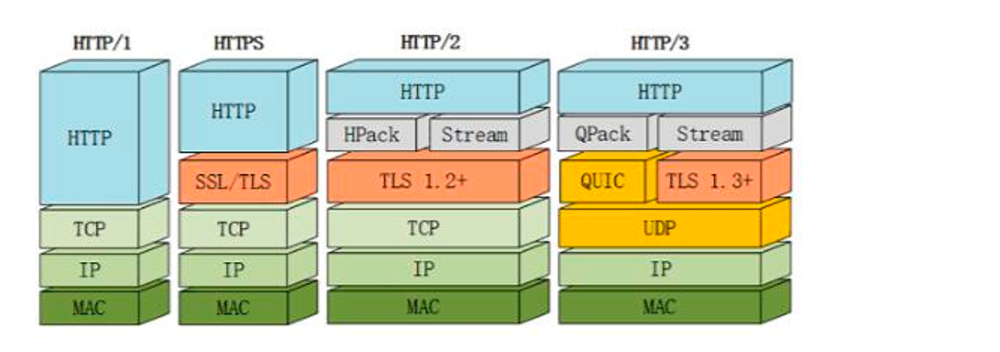

### **Проектирование API – gRPC**

---

## **1. Введение**

### **1.1 Что такое gRPC?**

- **gRPC** (Google Remote Procedure Call) – фреймворк для высокопроизводительных RPC-вызовов.
- **Особенности:**
  - Использует **Protocol Buffers** (бинарный формат).
  - Работает поверх **HTTP/2** (мультиплексирование, потоковая передача).
  - Поддерживает **4 типа вызовов**: унарный, серверный/клиентский поток, двунаправленный поток.



### **1.2 Сравнение с REST/GraphQL**

| **Критерий**                  | **REST/GraphQL**              | **gRPC**                           |
| ------------------------------------------- | ----------------------------------- | ---------------------------------------- |
| **Протокол**                  | HTTP/1.1, текстовый (JSON) | HTTP/2, бинарный (Protobuf)      |
| **Скорость**                  | Средняя                      | Высокая (до 10x быстрее) |
| **Типизация**                | Слабая (JSON)                 | Строгая (схема .proto)       |
| **Поддержка потоков** | Нет                              | Да                                     |

### **1.3 Когда выбирать gRPC?**

- **Микросервисы** (внутри кластера).
- **Реальное время** (чаты, игры).
- **Языково-независимые API** (Go, Python, Java и др.).

---

## **2. Практика: Создание gRPC-сервиса**

### **Задание: Сервис управления задачами (TodoList)**

**Функционал:**

- Добавление/получение задач.
- Уведомления о новых задачах (stream).

#### **Шаг 1: Установка инструментов**

```bash
pip install grpcio grpcio-tools
```

#### **Шаг 2: Определение API в `.proto`-файле**

Файл `todo.proto`:

```protobuf
syntax = "proto3";

service TodoService {
  rpc AddTask (TaskRequest) returns (TaskResponse);          // Унарный RPC
  rpc GetTasks (GetTasksRequest) returns (stream TaskResponse); // Серверный поток
}

message TaskRequest {
  string title = 1;
  string description = 2;
}

message TaskResponse {
  int32 id = 1;
  string title = 2;
  string description = 3;
  bool completed = 4;
}

message GetTasksRequest {}
```

#### **Шаг 3: Генерация кода из `.proto`**

```bash
python -m grpc_tools.protoc -I. --python_out=. --grpc_python_out=. todo.proto
```

Создаст файлы: `todo_pb2.py` (модели) и `todo_pb2_grpc.py` (сервер/клиент).

#### **Шаг 4: Реализация сервера**

Файл `server.py`:

```python
from concurrent import futures
import grpc
import todo_pb2
import todo_pb2_grpc

class TodoService(todo_pb2_grpc.TodoServiceServicer):
    def __init__(self):
        self.tasks = []
        self.next_id = 1

    def AddTask(self, request, context):
        task = todo_pb2.TaskResponse(
            id=self.next_id,
            title=request.title,
            description=request.description,
            completed=False
        )
        self.tasks.append(task)
        self.next_id += 1
        return task

    def GetTasks(self, request, context):
        for task in self.tasks:
            yield task  # Отправка задач через поток

def serve():
    server = grpc.server(futures.ThreadPoolExecutor(max_workers=10))
    todo_pb2_grpc.add_TodoServiceServicer_to_server(TodoService(), server)
    server.add_insecure_port('[::]:50051')
    server.start()
    print("Сервер запущен на порту 50051")
    server.wait_for_termination()

if __name__ == '__main__':
    serve()
```

#### **Шаг 5: Клиент**

Файл `client.py`:

```python
import grpc
import todo_pb2
import todo_pb2_grpc

def run():
    channel = grpc.insecure_channel('localhost:50051')
    stub = todo_pb2_grpc.TodoServiceStub(channel)

    # Добавляем задачу
    response = stub.AddTask(todo_pb2.TaskRequest(
        title="Изучить gRPC",
        description="Практическое занятие"
    ))
    print(f"Добавлена задача: {response.title} (ID: {response.id})")

    # Получаем задачи (поток)
    print("\nВсе задачи:")
    for task in stub.GetTasks(todo_pb2.GetTasksRequest()):
        print(f"- {task.title} (Выполнено: {task.completed})")

if __name__ == '__main__':
    run()
```

---

## **3. Проверка работы**

1. Запустите сервер:

   ```bash
   python server.py
   ```
2. В другом терминале запустите клиент:

   ```bash
   python client.py
   ```

   **Вывод:**

   ```
   Добавлена задача: Изучить gRPC (ID: 1)
   Все задачи:
   - Изучить gRPC (Выполнено: False)
   ```

---

## **4. Плюсы и минусы gRPC**

### **✅ Плюсы:**

- **Высокая скорость** (бинарный Protobuf + HTTP/2).
- **Строгая типизация** (автовалидация данных).
- **Поддержка потоков** (чаты, уведомления в реальном времени).

### **❌ Минусы:**

- **Сложность отладки** (бинарный формат).
- **Нет поддержки в браузерах** (требуется gRPC-Web).

---

## **5. Дополнительные задания**

1. **Добавьте метод `CompleteTask`** для отметки выполнения.
2. **Реализуйте двунаправленный поток** для чата задач.
3. **Подключите БД** (SQLite/PostgreSQL).

---

## **6. Итоги**

- gRPC идеален для **высоконагруженных сервисов** и **микросервисов**.
- **Используйте gRPC, когда:**
  - Нужна низкая задержка.
  - Есть контроль над клиентом и сервером (не для браузеров).

**Документация:**

- [Официальный сайт gRPC](https://grpc.io/)
- [gRPC Python Examples](https://github.com/grpc/grpc/tree/master/examples/python)
