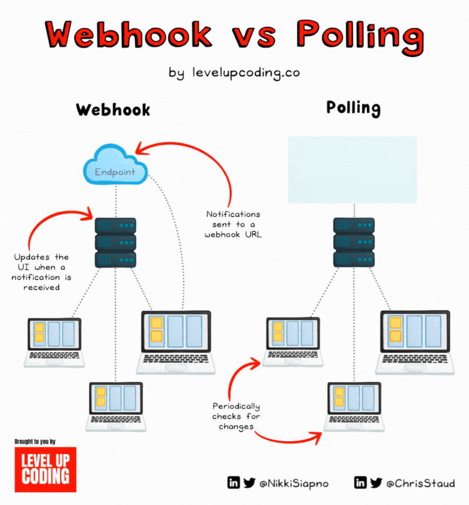
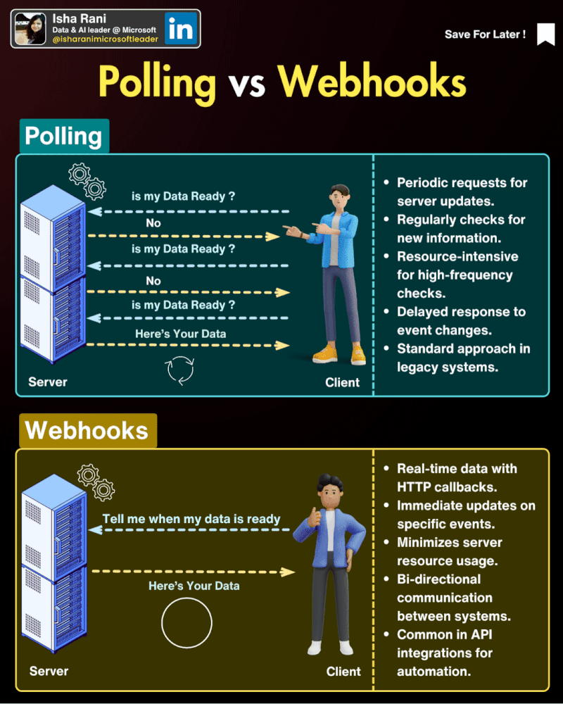

### **Webhooks vs Polling: сравнение и сферы применения**  



Оба подхода используются для получения данных от сервера, но работают принципиально по-разному:  

| **Критерий**       | **Webhooks** (вебхуки)                          | **Polling** (опрос)                          |
|--------------------|-----------------------------------------------|--------------------------------------------|
| **Как работает**   | Сервер **сам отправляет** данные клиенту при событиях. | Клиент **регулярно спрашивает** сервер: «Есть новое?» |
| **Задержка**       | Почти мгновенная (real-time).                  | Зависит от частоты опросов (например, раз в 5 сек). |
| **Нагрузка**       | Низкая (только при событиях).                  | Высокая (постоянные запросы, даже если данных нет). |
| **Надёжность**     | Зависит от доступности клиента.                | Клиент контролирует процесс.                |
| **Сложность**      | Нужен публичный URL и обработка подписей.      | Проще в реализации.                        |

---




## 🔹 **Где применяются Webhooks?**  
**Webhooks** идеальны для событий, которые должны обрабатываться **мгновенно**:  

### 1. **Уведомления от Git-платформ**  
- GitHub/GitLab отправляют вебхуки при:  
  - `push` в репозиторий,  
  - создании `pull request`,  
  - срабатывании CI/CD.  

### 2. **Платежные системы**  
- **Stripe**, **PayPal** уведомляют о:  
  - успешной оплате,  
  - отмене подписки,  
  - возврате денег.  

### 3. **Чат-боты (Slack, Telegram, Discord)**  
- Бот получает вебхук при новом сообщении в чате.  

### 4. **IoT (Интернет вещей)**  
- Датчики отправляют данные на сервер при изменении состояния (например, температура упала ниже 0°C).  

### 5. **Микросервисная архитектура**  
- Сервис **A** сообщает сервису **B** о завершении задачи (например, генерации отчёта).  

---

## 🔹 **Где применяется Polling?**  
**Polling** используется, когда:  
- нельзя настроить вебхуки (например, клиент за NAT/Firewall),  
- события не критичны к задержкам.  

### 1. **Почтовые клиенты**  
- Gmail/Outlook проверяют новую почту раз в 5–10 минут.  

### 2. **Соцсети (устаревшие API)**  
- Некоторые API Twitter/VK раньше требовали опроса для новых сообщений.  

### 3. **Игры с автосохранением**  
- Клиент раз в минуту отправляет данные на сервер.  

### 4. **Данные с датчиков (редкие обновления)**  
- Если температура меняется раз в час, опрос раз в 30 минут — норма.  

### 5. **Legacy-системы**  
- Старые банковские системы могут использовать polling для проверки статуса платежа.  

---

## 🔹 **Комбинированный подход: Long Polling**  
Гибридная технология (используется, например, в Telegram Bot API):  
1. Клиент отправляет запрос.  
2. Сервер **держи соединение открытым**, пока не появится событие.  
3. Как только событие есть — сразу возвращает ответ.  
4. Если событий долго нет — соединение разрывается, и клиент переподключается.  

**Плюсы**:  
- Меньшая задержка, чем у обычного polling.  
- Нет необходимости в публичном URL (как у вебхуков).  

---

## 🔹 **Что выбрать?**  
| **Ситуация**                          | **Webhooks** | **Polling** | **Long Polling** |
|---------------------------------------|-------------|------------|----------------|
| Нужны мгновенные уведомления         | ✅          | ❌         | ⚠️ (лучше вебхуки) |
| Клиент не имеет публичного URL        | ❌          | ✅         | ✅             |
| События редкие (раз в час)            | ⚠️ (неэффективно) | ✅        | ❌             |
| Высокая нагрузка на сервер недопустима| ✅          | ❌         | ✅             |

---

### **Примеры кода**  

#### **Polling на Python**  
```python
import requests
import time

def poll_server(url, interval=5):
    while True:
        response = requests.get(url)
        if response.status_code == 200:
            print("Новые данные:", response.json())
        time.sleep(interval)

poll_server("https://api.example.com/updates")
```

#### **Webhook + Flask**  
```python
from flask import Flask, request

app = Flask(__name__)

@app.route('/webhook', methods=['POST'])
def webhook():
    data = request.json
    print("Вебхук получен:", data)
    return "OK", 200

app.run(port=5000)
```

---

### **Итог**  
- **Webhooks** — для реального времени и минимизации нагрузки.  
- **Polling** — когда нельзя использовать вебхуки или события редкие.  
- **Long Polling** — компромисс, если вебхуки недоступны, но задержки нежелательны.  

Для современных приложений **вебхуки предпочтительнее**, но polling всё ещё жив в legacy-системах.