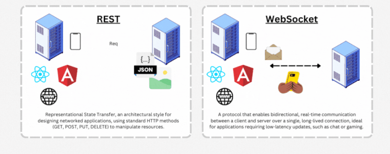
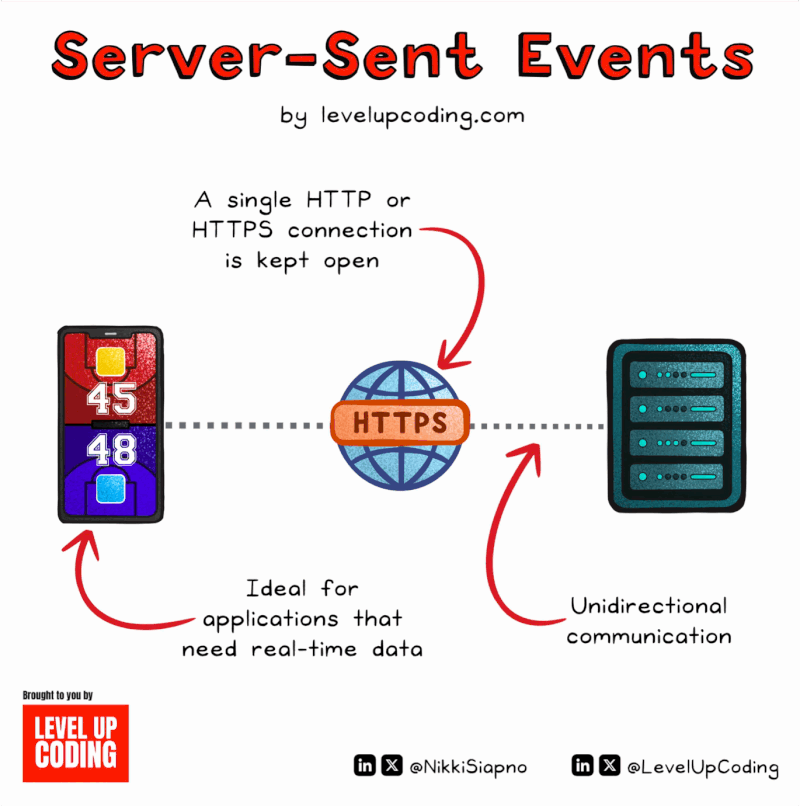
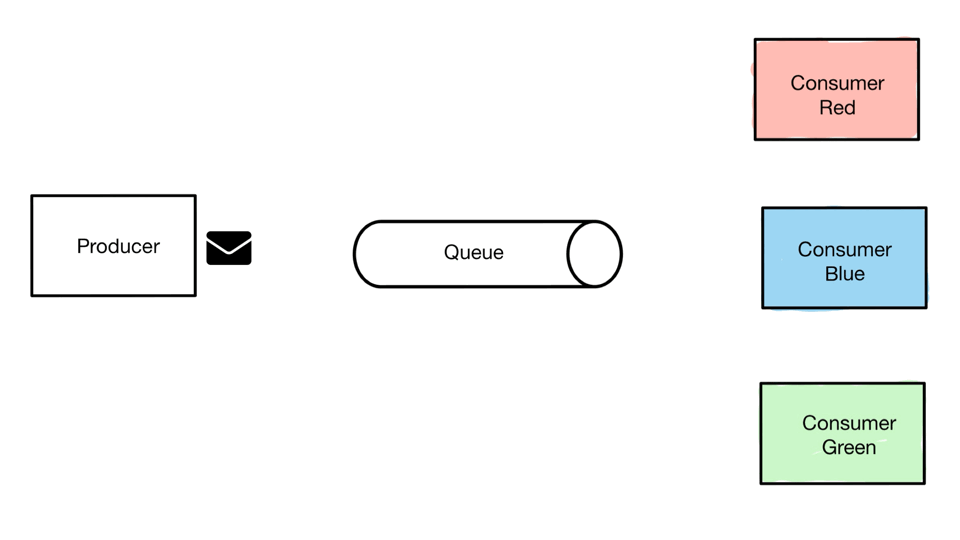
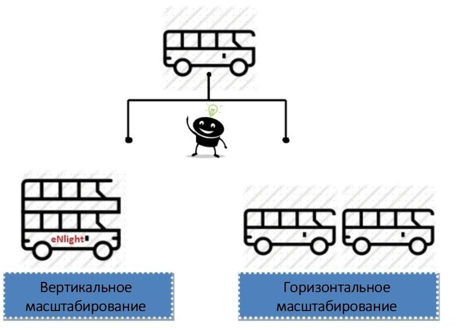
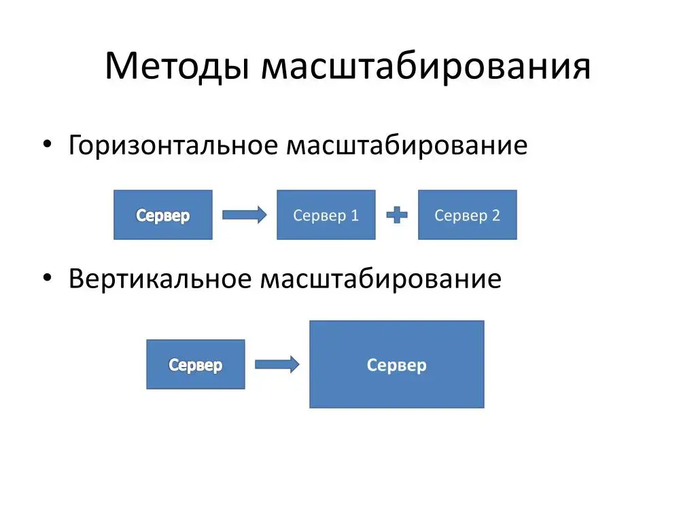

### **Event-based (событийно-ориентированные) асинхронные API**

**Формат:** Теория + Практика на Python (FastAPI + WebSockets + Redis)

---

## **1. Введение**



### Event-based (событийно-ориентированные) асинхронные API

**Event-based API** – это подход к проектированию асинхронных интерфейсов, где выполнение кода управляется событиями, а не последовательными вызовами. Вместо блокирующих операций или явного ожидания (как в синхронном или callback-based подходе) приложение реагирует на события, генерируемые системой или внешними сервисами.

### 🔹 **Ключевые особенности**

1. **Асинхронность** – операции выполняются без блокировки основного потока.
2. **Реактивность** – код выполняется в ответ на события (например, клик, HTTP-запрос, сообщение из очереди).
3. **Отсутствие явных потоков** – управление передаётся циклу событий (event loop), а не создаётся множество потоков.
4. **Масштабируемость** – хорошо подходит для I/O-задач (сети, файлы, БД).

### 🔹 **Примеры технологий и API**

- **Веб/Frontend**:
  - `EventTarget` в браузерах (`addEventListener`).
  - WebSockets (`onmessage`, `onopen`).
  - `fetch` + `Promise` (но можно обернуть в события).
- **Backend/Серверные API**:
  - Node.js (`EventEmitter`, `stream`, `http.Server`).
  - RabbitMQ, Kafka (обработка сообщений как событий).
  - Webhooks (HTTP-колбэки от внешних сервисов).
- **Другие**:
  - GUI-библиотеки (Qt, GTK).
  - IoT (MQTT-брокеры).

### 🔹 **Пример на Node.js (EventEmitter)**

```javascript
const EventEmitter = require('events');

class MyEmitter extends EventEmitter {}

const myEmitter = new MyEmitter();

// Подписываемся на событие
myEmitter.on('event', (data) => {
  console.log('Событие произошло!', data);
});

// Генерируем событие
myEmitter.emit('event', { id: 1, message: 'Hello' });
```

### 🔹 **Плюсы**

✔ Эффективность для I/O-bound задач.
✔ Лучшая масштабируемость, чем у потоков.
✔ Чёткое разделение логики (подписка/генерация событий).

### 🔹 **Минусы**

❌ Сложнее отлаживать (поток выполнения нелинейный).
❌ Возможны "утечки" слушателей (memory leaks, если не отписаться).
❌ Callback hell (если не использовать `Promise`/`async-await`).

Event-based API отлично подходит для реактивных систем, но требует аккуратного управления подписками и ошибками. В современных приложениях часто комбинируется с `Promise` и `async-await`.

### **1.1 Что такое событийные API?**

- **Event-based API** реагируют на события в реальном времени (сообщения, уведомления, изменения данных).
- **Отличие от REST:**
  - REST: клиент инициирует запросы ("тянет" данные).
  - Event-based: сервер отправляет данные при событиях ("толкает" данные).

### **1.2 Технологии для событийных API**

| **Технология**           | **Использование**                                             |
| ---------------------------------------- | -------------------------------------------------------------------------------- |
| **WebSockets**                     | Двустороннее соединение в реальном времени |
| **Server-Sent Events (SSE)**       | Односторонний поток от сервера                        |
| **Message Brokers (Redis, Kafka)** | Очереди событий между сервисами                      |






### **1.3 Сценарии применения**

- Чат-приложения
- Торговые платформы
- IoT-устройства
- Уведомления в реальном времени

---





## **2. Практика: Создание чат-API**

### **2.1 Установка зависимостей**

```bash
pip install fastapi uvicorn websockets redis python-socketio
```

### **2.2 WebSocket-сервер на FastAPI**

Файл `main.py`:

```python
from fastapi import FastAPI, WebSocket, WebSocketDisconnect
from fastapi.middleware.cors import CORSMiddleware
import redis
import json

app = FastAPI()

# Подключение к Redis для pub/sub
r = redis.Redis(host='localhost', port=6379, decode_responses=True)

# Хранилище активных соединений
active_connections = set()

@app.websocket("/ws/{user_id}")
async def websocket_endpoint(websocket: WebSocket, user_id: str):
    await websocket.accept()
    active_connections.add(websocket)
    pubsub = r.pubsub()
    pubsub.subscribe("chat_channel")  # Подписываемся на канал

    try:
        while True:
            # Ожидание сообщений от клиента
            data = await websocket.receive_text()
            message = {"user_id": user_id, "text": data}
  
            # Публикация в Redis
            r.publish("chat_channel", json.dumps(message))
  
    except WebSocketDisconnect:
        active_connections.remove(websocket)
        pubsub.unsubscribe("chat_channel")

# Фоновый процесс для рассылки сообщений
@app.on_event("startup")
async def startup_event():
    import asyncio
    asyncio.create_task(event_listener())

async def event_listener():
    pubsub = r.pubsub()
    pubsub.subscribe("chat_channel")
  
    for message in pubsub.listen():
        if message["type"] == "message":
            data = json.loads(message["data"])
            # Рассылка всем подключенным клиентам
            for connection in active_connections.copy():
                try:
                    await connection.send_text(f"User {data['user_id']}: {data['text']}")
                except:
                    active_connections.remove(connection)
```

### **2.3 Клиент на JavaScript (для тестирования)**

Файл `static/index.html`:

```html
<!DOCTYPE html>
<html>
<body>
  <input id="message" placeholder="Сообщение">
  <button onclick="sendMessage()">Отправить</button>
  <div id="chat"></div>

  <script>
    const ws = new WebSocket("ws://localhost:8000/ws/user123");
  
    ws.onmessage = (event) => {
      document.getElementById("chat").innerHTML += `<p>${event.data}</p>`;
    };

    function sendMessage() {
      const message = document.getElementById("message").value;
      ws.send(message);
    }
  </script>
</body>
</html>
```

---

## **3. Проверка работы**

1. Запустите сервер:
   ```bash
   uvicorn main:app --reload
   ```
2. Откройте `static/index.html` в браузере.
3. Откройте вторую вкладку с тем же файлом для имитации двух пользователей.

**Результат:**

- Сообщения появляются в реальном времени у всех подключенных клиентов.

---

## **4. Оптимизация и масштабирование**

### **4.1 Паттерны проектирования**

- **Publisher/Subscriber (Pub/Sub):**
  ```python
  r.publish("channel", "data")  # Отправка
  r.subscribe("channel")        # Получение
  ```
- **Event Sourcing:** Хранение всех событий для восстановления состояния.

### **4.2 Горизонтальное масштабирование**

- Используйте **Nginx** для балансировки нагрузки.
- Подключите **Kafka** или **RabbitMQ** для распределенной обработки событий.

---

## **5. Дополнительные задания**

1. **Добавьте авторизацию** (JWT для WebSocket).
2. **Реализуйте комнаты чата** (раздельные каналы в Redis).
3. **Подключите базу данных** для хранения истории сообщений.

---

## **6. Итоги**

- **Event-based API** идеальны для систем реального времени.
- **WebSockets + Redis** – простое решение для чатов и уведомлений.
- **Для сложных систем** используйте Kafka/RabbitMQ.

**Документация:**

- [FastAPI WebSockets](https://fastapi.tiangolo.com/advanced/websockets/)
- [Redis Pub/Sub](https://redis.io/topics/pubsub)

🚀 Вы создали событийное API на Python.
